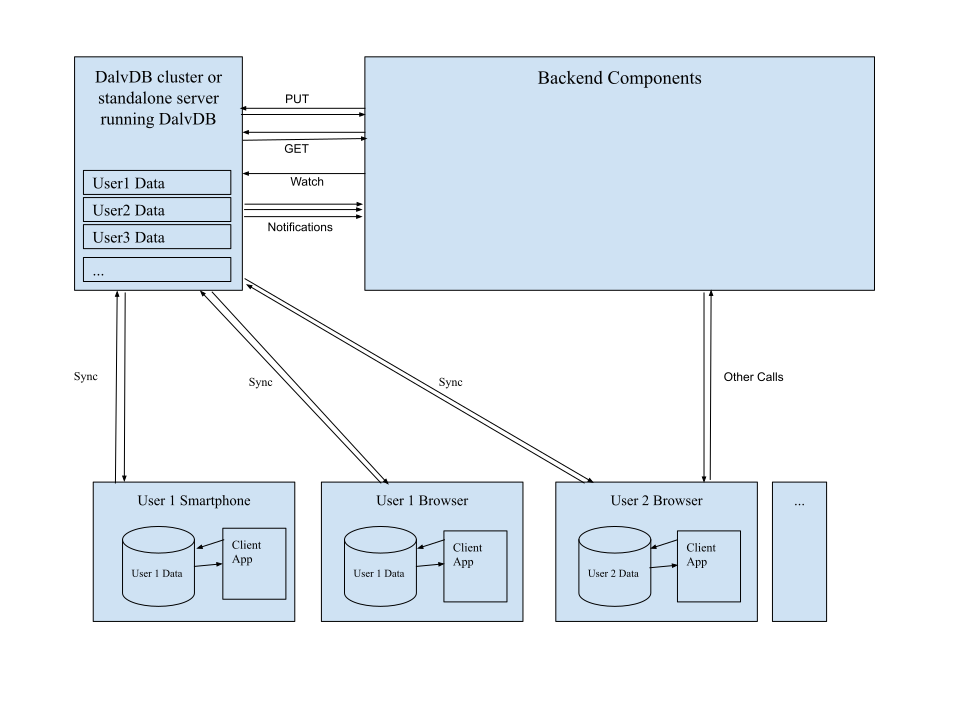

## Introduction
DalvDB is a key/value storage that leverages modern client's capabilities, to consider client application storage as a replica of the database.
By partitioning data using userId as partition key, it requires clients to store just as much data as it related to the user.
Client replicas could accept write to certain part of data and synchronize its writes afterward, it could also lag behind 
the server for a considerable amount of time(days or even months) but DalvDB application layer conflict resolution 
mechanism prevent the loss of data and give the opportunity to the application to implement all kinds of business related 
scenarios during the conflict.

A considerable amount of data generated from each online service belong to its users. user themselves, or other server 
side components, modify those data.
 
 Conventional partitioning methods which uses 'user identifier' to partition data, is useful to
spread out data to multiple machines or even multiple data-centers in the server side, usually keeping data near user's
location to reduce read latency.

By storing a replica of the user data on him/her client's device, this method improve user experience as it reduces read/write latency.
It also decreases servers workload by acts like a cache in the user device. 

## Use Cases
DalvDB could be used as a side data-store for some specific data. it can also be the only data-store of a user centric 
online service, for example, an Online Calendar service. Additionally, DalvDB could be used as client side cache 
mechanism which the client just read data from it and update it on some basis.  

There are several examples of use cases which user owns the data and only user has the permission to change it.
The use cases include but not limited to:
- User preferences
- Shopping card
- profile info
- saved posts/products/pages
- search history
- following list

Also, virtually everything that could be cached on server side has this capability to be cached on client device, 
regardless if the fact that the user is the owner of the data or not, for example:
- Order history
- List of follower
- Timeline
- Product categories